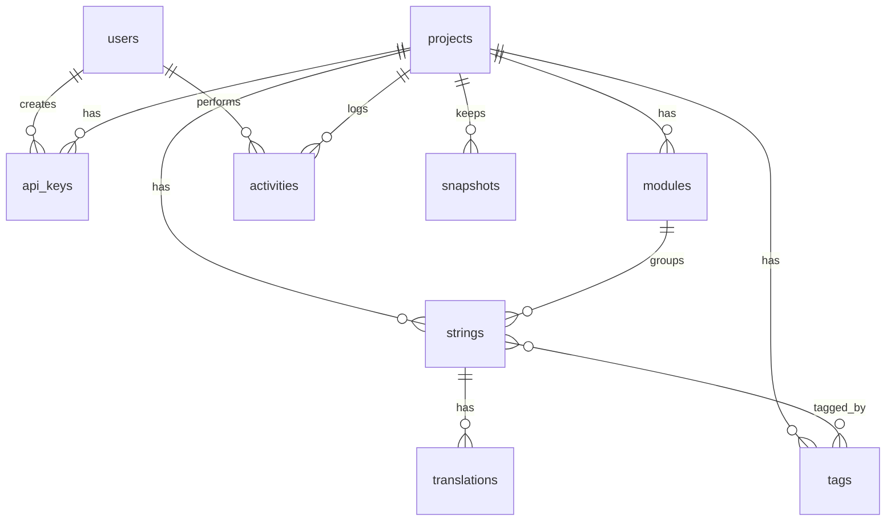
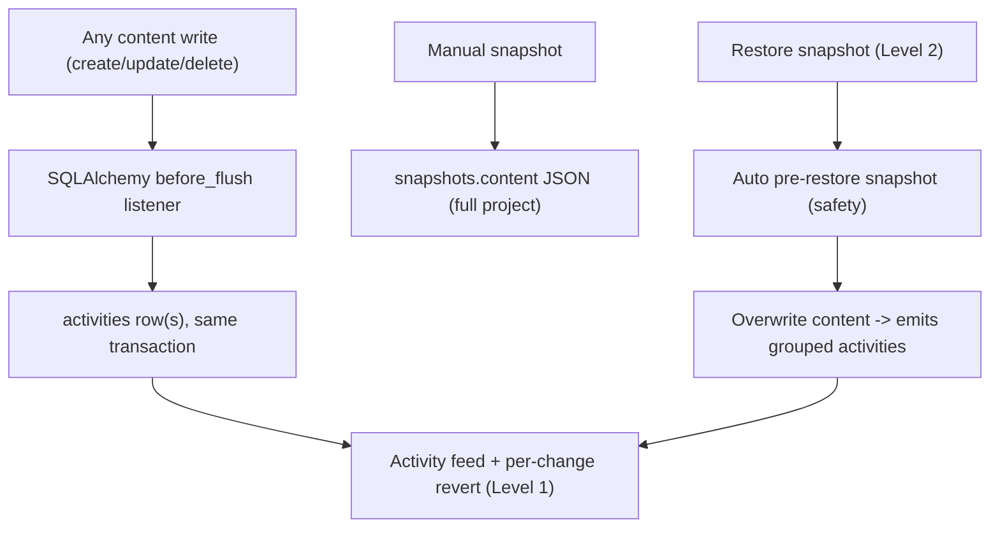

# TMS Scale-Up Plan

## Current state (verified)

- Backend: FastAPI + SQLAlchemy 2, 3 tables only — `projects`, `strings`, `translations` ([backend/app/models.py](backend/app/models.py)). No modules, tags, users, or migrations. Schema is created by `Base.metadata.create_all` + `seed_demo_data()` on startup ([backend/app/main.py](backend/app/main.py)).
- Auth: a single `?api_key=` query param that resolves one project ([backend/app/auth.py](backend/app/auth.py)). `tms_secret` in [backend/app/config.py](backend/app/config.py) is dead config.
- Export is flat-only `{locale: {key: value}}` and import accepts `{strings: {key: text}}` ([backend/app/routers/sync.py](backend/app/routers/sync.py)).
- CLI is 193 lines, flat JSON, `init/push/pull` ([cli/tms_cli/main.py](cli/tms_cli/main.py)).
- Frontend is one 274-line component with hand-rolled `fetch` and plain CSS ([frontend/src/App.tsx](frontend/src/App.tsx), [frontend/src/api.ts](frontend/src/api.ts)).

Confirmed decisions: generic OIDC via Authlib; any authenticated user may access all projects (no roles yet); modules always stored, project setting only controls export layout; Excel = one sheet per module; status per translation (`draft`/`public`) with a stage-aware read.

## Target data model




New/changed columns:

- `users` — `id, email, name, avatar_url, oidc_issuer, oidc_sub, created_at, last_login_at`; unique `(oidc_issuer, oidc_sub)`.
- `api_keys` — `id, project_id, name, key_prefix, key_hash, created_by, created_at, last_used_at, revoked_at`. Moves `api_key` off `projects` so keys can be rotated/revoked.
- `projects` — add `slug`, `layout` (`flat` | `modular`), `created_by`, `updated_at`; `base_language` default becomes `"vi"` (still editable per project, and the app-wide default comes from a `DEFAULT_BASE_LANGUAGE` setting).
- `modules` — `id, project_id, slug, name, description, position`; unique `(project_id, slug)`. Slug is the folder name used for lazy-loaded bundles.
- `strings` — add `module_id` (nullable, `ON DELETE SET NULL`). Uniqueness changes from `(project_id, key)` to `(project_id, module_id, key)` so `login.title` and `home.title` can coexist as `title` in two modules.
- `translations` — status enum `draft | live` becomes `draft | public`; add `updated_by`.
- `tags` + `string_tags` join table for batch selection and batch status changes.

Flat export prefixes module-scoped keys as `{module_slug}.{key}` to stay collision-free; unassigned keys export as-is.

## Phase 0 — Foundations

- Add Alembic to [backend/pyproject.toml](backend/pyproject.toml); baseline revision reproduces today's 3 tables, subsequent revisions add everything above. Remove `create_all` + auto-seed from `lifespan`; replace with `alembic upgrade head` in the Docker entrypoint and an explicit `python -m app.cli seed-demo`.
- Mount all routers under `/api` (`/health` stays at root). Drop the `rewrite` in [frontend/vite.config.ts](frontend/vite.config.ts) and the `${API_URL}` juggling in `api.ts`; this also removes the SPA-vs-API path conflict in prod.
- Tooling: Ruff + pytest (with `TestClient` + SQLite fixtures) for backend; ESLint + Prettier + Vitest for frontend.
- `openapi-typescript` generates `frontend/src/lib/api/schema.d.ts` from the live OpenAPI doc via an `npm run gen:api` script, replacing the hand-duplicated types in `api.ts`.

## Phase 1 — OAuth2 / OIDC

- Deps: `authlib`, `pyjwt`, `itsdangerous`.
- Settings: `OIDC_ISSUER`, `OIDC_CLIENT_ID`, `OIDC_CLIENT_SECRET`, `OIDC_SCOPES` (default `openid email profile`), `OIDC_REDIRECT_URL`, `AUTH_DEV_BYPASS`.
- Routes: `GET /api/auth/login` → provider redirect; `GET /api/auth/callback` → upsert user, issue an httpOnly `SameSite=Lax` session JWT signed with the now-used `TMS_SECRET`; `POST /api/auth/logout`; `GET /api/auth/me`.
- `AUTH_DEV_BYPASS=true` mints a local dev user so contributors don't need an IdP running.
- Two dependencies replace today's single one:
  - `current_user` (session cookie) for all TMS UI endpoints — has access to every project.
  - `project_from_api_key` reading `X-API-Key` (keep `?api_key=` accepted for back-compat) for CLI/runtime endpoints.
  - Export/import/bundle accept either.

## Phase 2 — Multi-project + modules + tags + status

New/reshaped routers under `backend/app/routers/`:

- `projects.py` — `GET/POST /api/projects`, `GET/PATCH/DELETE /api/projects/{id}`, `GET/POST/DELETE /api/projects/{id}/api-keys`. Create accepts `name`, `base_language` (defaults to `vi`), `target_languages[]`, `layout`.
- `languages.py` — `GET /api/languages`, a static catalog of locale codes + display names to populate the target-language multi-select.
- `modules.py` — CRUD, slug validated `^[a-z][a-z0-9_-]*$`.
- `tags.py` — CRUD with name + color.
- `strings.py` — rewritten. Addressing moves from `{key}` to `{string_id}` (keys are no longer project-unique). List endpoint gains server-side filtering + pagination: `?module=&tag=&q=&missing_locale=&status=&page=&page_size=`.
- `PUT /api/projects/{id}/strings/{string_id}/translations/{locale}` upserts a translation value and status.

Batch operations (the "CRUD by batch instead of item per item" requirement):

- `POST /api/projects/{id}/strings/batch` with `{ action, string_ids | filter, payload }` where action is one of `publish`, `unpublish`, `delete`, `move_module`, `add_tags`, `remove_tags`. Accepting a `filter` instead of ids lets "publish everything tagged `release-1.4`" run without shipping thousands of ids.

AI translation consolidates the two current endpoints into one:

- `POST /api/projects/{id}/translate` with `{ scope: "missing" | "strings" | "module" | "tag", string_ids?, module_id?, tag_id?, locales?, overwrite: false }`. Small scopes run synchronously; project-wide runs write a `jobs` row and execute via `BackgroundTasks`, polled at `GET /api/jobs/{id}`. Newly machine-translated values land as `draft`, never `public`.

## Phase 2.5 — Activity log & revert (version control)

Adds an append-only audit trail (Level 1) with per-change revert, plus named whole-project snapshots (Level 2). Content = `strings` + `translations` is revertible; structural entities (projects, modules, tags, api_keys) are logged for audit but not revertible.



New tables (one Alembic revision on top of the Phase 0 Alembic setup):

- `activities` (append-only): `id, project_id (FK CASCADE, index), actor_type (user|api_key|system), actor_id, actor_label, action (create|update|delete), entity_type (string|translation|module|tag|project|api_key), entity_id, string_id (nullable, index - groups translation rows under their string), locale (nullable), before JSON, after JSON, summary, batch_id (nullable, index), batch_kind (import|excel_import|batch|translate|revert|snapshot_restore), revert_of_id (nullable), reverted_by_id (nullable), is_revertible (bool), created_at (index)`. Content entity types set `is_revertible=true`; structural types are log-only.
- `snapshots`: `id, project_id (FK CASCADE), name, description, kind (manual|auto), content JSON, string_count, content_hash, created_by, created_at`. `content` shape: `{ base_language, target_languages, strings: [{ id, key, module_id, source_text, description, translations: [{ locale, value, status }] }] }`.

Recording infrastructure — new `backend/app/activity.py`:

- Capture via a SQLAlchemy `before_flush` session event (registered in `database.py`/`main.py`) so every write path — current `routers/strings.py` and `routers/sync.py` plus the Phase 2 rewrites — is covered with no per-route wiring. The listener walks `session.new/dirty/deleted` for `StringEntry` and `Translation`, uses `inspect(obj).attrs.<field>.history` to build `before`/`after`, and appends `Activity` rows in the same transaction (atomic). It skips `Activity`/`Snapshot` objects (no recursion) and skips auto-created empty translation rows (noise filter).
- Actor + batch context rides on the session, not a contextvar: a dependency sets `db.info["activity"] = {actor_type, actor_id, actor_label}` from `current_user` or `project_from_api_key`; batch/import/translate/restore routes also set `batch_id`/`batch_kind` so bulk changes group into one revertible entry. The listener reads `session.info["activity"]`.

Level 1 — revert API:

- `GET /api/projects/{id}/activities?entity_type=&string_id=&actor=&action=&batch_id=&since=&until=&page=&page_size=` — paginated feed, newest first, includes reverted state.
- `GET /api/projects/{id}/strings/{string_id}/activities` — per-string history for the editor drawer.
- `POST /api/projects/{id}/activities/{activity_id}/revert` — undo one content change: `update` restores `before`; `create` deletes the created entity; `delete` re-inserts the entity (and child translations) from `before`. Conflict guard: current row must still match the activity's `after`, else `409` unless `?force=true`. The revert is itself recorded (`batch_kind=revert`, `revert_of_id` set) and stamps the original's `reverted_by_id`, enabling redo. Non-revertible (structural) activities return `400`.
- `POST /api/projects/{id}/activities/batch/{batch_id}/revert` — reverts every activity in the batch in reverse order.

Level 2 — snapshots API:

- `POST /api/projects/{id}/snapshots` `{name, description}` — serialize current content into `snapshots.content` + hash.
- `GET /api/projects/{id}/snapshots` (metadata only) and `GET .../snapshots/{sid}`.
- `POST /api/projects/{id}/snapshots/{sid}/restore` — overwrite content to the snapshot: upsert strings/translations from the doc and delete rows not in it. Before applying, auto-create a `kind=auto` snapshot ("Auto-save before restore of <name>") so restore is reversible. Runs in one transaction with `batch_kind=snapshot_restore`, so it also emits grouped Level 1 activities.
- `DELETE /api/projects/{id}/snapshots/{sid}`.

Synergy: a restore emits grouped `activities`, so it is inspectable and partially revertible via the Level 1 feed; the pre-restore auto-snapshot gives one-click whole-project rollback.

## Phase 3 — Stage-aware export/bundles

`GET /api/projects/{id}/export?format=json|xlsx&layout=flat|modular&stage=draft|public`

- `stage=draft` returns the latest value for every translation.
- `stage=public` returns only translations with `status="public"`, falling back to base-language source text so production never renders a raw key.
- `layout` defaults to the project's configured layout; the query param is an override.
- Modular shape: `{ "modules": { "login": { "vi": {...}, "en": {...} } }, "unassigned": {...} }`, plus a `manifest.json` listing modules, locales, and a content hash so the consuming app can `import()` one module bundle at a time.

`POST /api/projects/{id}/import` — multipart upload, format inferred from extension, `?dry_run=true` returns a create/update/orphan diff for UI preview before committing.

## Phase 4 — Excel round-trip

- Dep: `openpyxl`. New `backend/app/excel.py`.
- Workbook shape: one sheet per module (sheet name = module slug), plus an `_unassigned` sheet. Columns: `key`, `description`, `tags` (comma-separated), then one column per locale, base language first. A hidden `_meta` sheet carries project id, base language, and export stage so import can validate it's the right workbook.
- Import creates missing modules and tags, upserts by `(module, key)`, and reports per-sheet counts. Import never auto-publishes — imported values stay `draft` unless the caller passes `status=public`.

## Phase 5 — Frontend rebuild

Keep Vite + React 18 + TypeScript; replace everything inside `frontend/src`.

- Add `@tanstack/react-router` (+ `@tanstack/router-plugin` for file-based routes), `@tanstack/react-query`, `@tanstack/react-form`, `zod`, `zustand`, `tailwindcss`, shadcn/ui (Radix + `class-variance-authority` + `tailwind-merge`), `lucide-react`, `@tanstack/react-table` for the strings grid.
- Routes: `/login`, `/` (project list), `/projects/new`, and under `/projects/$projectId`: `overview`, `strings`, `modules`, `tags`, `settings`, `import-export`.
- TanStack Query owns all server state; route loaders call `queryClient.ensureQueryData` so navigation doesn't waterfall. Zustand owns only client state — row selection, visible locale columns, filter-panel open state, theme.
- Grid filters (module, tag, search, missing-locale, status) live in URL search params via the router's `validateSearch`, making filtered views shareable and making the batch-by-filter API a natural fit.
- TanStack Form + zod schemas for project create/settings, string editor, module and tag dialogs.
- Per the workspace React guidelines: import icons normally and rely on `optimizePackageImports`-style handling, keep the heavy grid and the Excel import preview behind `React.lazy`, and use `useTransition` for filter changes rather than manual loading flags.

Key screens mapping to the requirements: project settings holds base language + target languages + layout choice + API keys; the strings grid holds inline per-locale editing, multi-select with a batch action bar (publish, tag, move module, delete), a per-row "translate" button, and a "translate all missing" action.

Two more routes under `/projects/$projectId`: `activity` (filterable feed with per-row revert, batch revert, "reverted" badges) and `versions` (snapshot list: create, restore-with-confirm, delete). The string editor gains a "History" tab (per-string activities with inline revert). Revert/restore are TanStack Query mutations that invalidate the strings + activities queries; lazy-load both panels and use `useTransition` for feed filters per the workspace React guidelines. Ensure the batch action bar and Excel import set a `batch_id` so their changes appear as a single revertible entry.

## Phase 6 — CLI

`.tms/config.yaml` carries everything so day-to-day commands take no flags:

```yaml
api_url: http://localhost:8000
project_id: <uuid>
api_key: tms_xxx
output_dir: ./src/locales
layout: modular       # or flat
stage: draft          # public in CI/prod builds
base_language: vi
locales: [vi, en, ko, ja]   # optional; defaults to project config
manifest: true
```

Commands: `tms init` (interactive; pulls project config from the server so nothing is retyped), `tms push`, `tms pull`, `tms sync` (push then pull), `tms status` (local vs remote diff: missing keys, unused keys, untranslated counts). Every config value has a matching override flag (`--stage`, `--layout`, `--locales`, `--output-dir`).

Modular pull writes `locales/{module}/{locale}.json` + `locales/manifest.json`; flat pull writes `locales/{locale}.json`. Push scans base-language files, derives module slugs from directory names, and reports orphaned remote keys rather than deleting them.

## Phase 7 — Ops and docs

- Update [docker-compose.yml](docker-compose.yml) / [docker-compose.prod.yml](docker-compose.prod.yml) and [.env.example](.env.example) for the OIDC vars and the migration entrypoint.
- Rewrite [README.md](README.md) and [cli/README.md](cli/README.md); add `docs/` covering the data model, the flat-vs-modular decision, and the draft/public workflow.
- Reseed demo data as a Vietnamese-base project with `auth`, `home`, `common` modules.
- Document the version-control workflow (feed, revert, snapshots); add optional `ACTIVITY_RETENTION_DAYS` pruning since `activities` is append-only and grows, and note that `snapshots.content` stores full-project JSON (size trade-off, revisit with a `snapshot_entries` child table if needed).

## Risks

- Changing string uniqueness to `(project_id, module_id, key)` and moving API addressing from `{key}` to `{string_id}` is breaking for the current CLI and frontend. Both are rewritten in this plan, so the migration is a one-shot cutover rather than a compatibility layer.
- The `draft`→`public` enum rename needs a data migration step (`UPDATE translations SET status='public' WHERE status='live'`) inside the Alembic revision.
- `before_flush` must skip its own `Activity`/`Snapshot` rows and empty auto-created translations to avoid recursion/noise.
- Reverting a delete recreates the row with its original UUID; if its `module_id` module was since deleted, set it null (matches `ON DELETE SET NULL`).
- `snapshots.content` JSON can grow large for big projects; acceptable for MVP.
- Restore is destructive by design; the auto pre-restore snapshot is the safety net.

